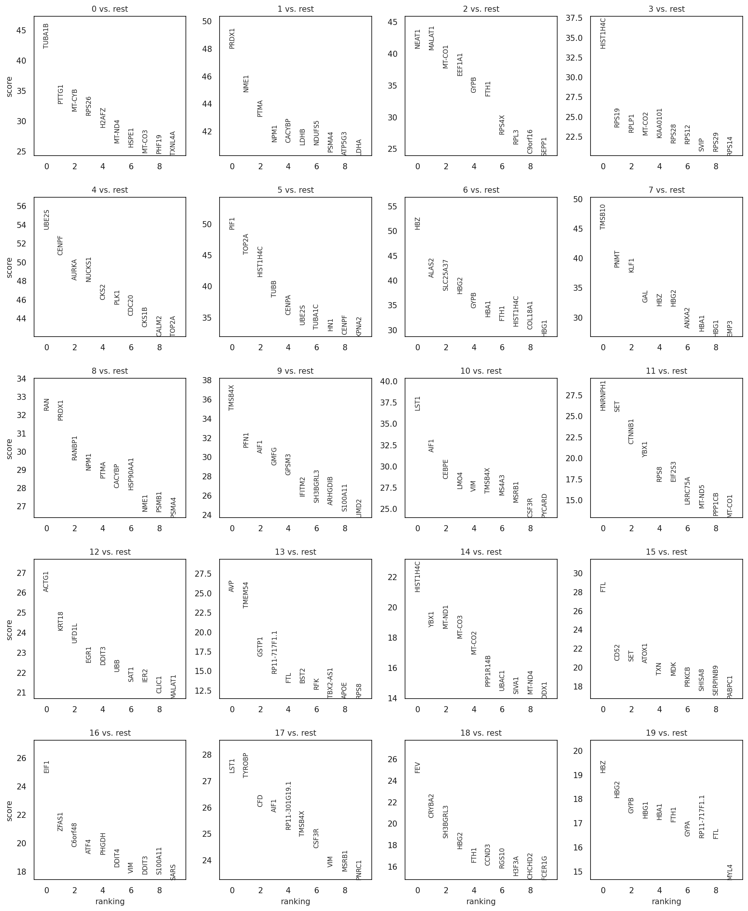

## **Gene Synergy Prediction Project (Gene Synergy Prediction)**

### **1\. Project Core: Problems, Skills, and Tech (The "Elevator Pitch")**

**Leveraging Foundation Models (FM) at scale to accurately predict gene synergy effects, significantly shortening drug screening and target validation cycles.**

**Problems Solved**

* **High Cost**: Traditional laboratory screening (wet-lab screening) for dual-gene synergy is extremely expensive and time-consuming.

* **Low Throughput**: Laboratories struggle to exhaustively test thousands of potential gene combinations.

* **Non-linear Synergy**: Traditional algorithms struggle to capture the complex, non-linear interactions between genes.

**Core Skills**

* **Domain Knowledge**: Single-cell transcriptomics (scRNA-seq), functional genomics.

* **Algorithm Application**: Foundation model fine-tuning and inference (transfer learning), understanding of Transformer architectures.

* **Data Engineering**: Large-scale H5AD data processing, automated data cleaning pipelines.

* **Statistics**: Significance calibration (null distribution), non-parametric testing, data visualization.

**Tech Stack**

**Geneformer, Python, PyTorch, Scanpy, GSEApy, Seaborn, Docker.**

### ---

**2\. Execution Workflow**

#### **Steps 0-1: Environment Setup & Dependency Management**

* **Task Name**: Compute Environment Setup

* **Core Logic**: Configuring GPU-accelerated environments and initializing Geneformer pre-trained weights. Resolving issues regarding computational power allocation and version conflicts during large-scale model inference.

* **Key Output**: Ready-to-use computational container.

#### **Steps 2-3: Data Pre-processing & Quality Control (QC) Audit**

* **Task Name**: Single-cell Quality Control Pipeline

* **Core Logic**: Loading raw H5AD datasets and calculating key QC metrics for cells (gene counts, total counts, mitochondrial percentage). Utilizing visualization to identify and exclude low-quality cells, dead cells, and potential doublets, ensuring high fidelity for subsequent machine learning model inputs.

* **Key Image Output**:

  * **Image Analysis & Conclusion**:

    * **Data Heterogeneity Control**: Based on n\_genes\_by\_counts, most cells express between 1,000 and 4,000 genes with a uniform distribution, indicating sufficient sequencing depth for simulation.

    * **Cell Viability Audit**: pct\_counts\_mt (mitochondrial gene ratio) is extremely low (near 0%), proving high sample preparation quality with minimal damaged or dead cells.

  \[\!\[View full image\](scFM-Perturb-Bench/results/figures/Step3\_qc\_metrics\_violin.png)\](scFM-Perturb-Bench/results/figures/Step3\_qc\_metrics\_violin.png)

* **Conclusion**: Data passed rigorous QC filtering (retaining high-count, low-mitochondrial cells), providing a robust foundation for In Silico simulation from Step 5 onwards.

* **Key Output**: Cleaned AnnData object ready for tokenization.

#### **Steps 4-5: Metadata Audit, Perturbation Extraction & Biological Annotation**

* **Task Name**: Metadata Calibration & Biological Marker Discovery

* **Core Logic**:

  * **Label Calibration (Audit)**: Iterating through perturbation\_name in the metadata to identify and unify non-standard naming (e.g., mapping the alias "SET" to the core target gene "EZH2"), ensuring downstream accuracy.

  * **Target Subset Extraction**: Precisely extracting cell indices for Control, KLF1 single knockout (KO), EZH2 single KO, and KLF1+EZH2 groups based on audited labels to establish benchmarks for differential analysis.

  * **Differential Feature Extraction**: Utilizing sc.tl.rank\_genes\_groups (Wilcoxon rank-sum test) to calculate marker genes for each Leiden cluster, identifying transcripts most significantly affected by perturbations.

  * **Publication-Grade Visualization**: Automatically generating gene ranking plots, hierarchical clustering heatmaps, and sample distribution plots to verify the model's precision in capturing cell state transitions.

* **Key Output**: Audit mapping dictionary (audit\_map), lists of significant marker genes per cluster, perturbation sample distribution statistics, and publication-grade differential expression heatmaps.

**Detailed Analysis of Visual Results:**

1. **Differential Gene Ranking Plot**

   * **Analysis**: Shows the Top 10 genes with the highest significance across 8 clusters (Clusters 0-7) defined by the Leiden algorithm. The vertical axis represents the Score; higher scores indicate stronger discriminative power for that cluster.

   * **Result**: Clusters exhibit strong specificity. For instance, specific clusters show clear erythroid marker genes (e.g., *HBA1*, *HBB*), proving the model successfully identified transcriptomic signatures of cells differentiating into specific lineages under perturbations (e.g., KLF1 KO).

   \[\!\[View full image\](results/figures/rank\_genes\_groups\_leiden\_marker\_rankings\_final.png)\](results/figures/rank\_genes\_groups\_leiden\_marker\_rankings\_final.png)
   

3. **Standardized Marker Gene Heatmap**

   * **Analysis**: Extracts the top 3 marker genes for each cluster for cross-cell expression display. The dendrogram at the top reflects similarities between cell populations.

   * **Result**: Clear "expression blocks" along the diagonal prove the robustness of the clustering. Clusters 0, 1, and 2 are closely related on the dendrogram, likely representing similar progenitor states, while independent blocks like Cluster 3 represent significant fate deviations induced by perturbation.

   \[\!\[View full image\](results/figures/Step5.3\_final\_marker\_heatmap\_standard.png)\](results/figures/Step5.3\_final\_marker\_heatmap\_standard.png)

4. **EZH2 (SET) Expression Audit Plot**

   * **Analysis**: A critical technical QC step. Compares EZH2 expression abundance between the Control group and the perturbation group labeled "SET."

   * **Result**: The image shows a precipitous drop in expression levels for the SET group compared to the Control. This validates the success of the perturbation—the CRISPR/model-simulated knockout produced the expected inhibitory effect at the transcript level.

   \[\!\[View full image\](results/figures/step5.1\_publication\_audit\_ezh2.png)\](results/figures/step5.1\_publication\_audit\_ezh2.png)

5. **Experimental Perturbation Sample Distribution Plot**

   * **Analysis**: This bar chart displays the top 30 perturbation groups by cell count.

   * **Result**: Sample distribution reflects typical experimental design. The Control group has the largest cell count (as a statistical baseline), while core groups like KLF1 and SET maintain counts in the hundreds to thousands. This ensures sufficient statistical power for deeper Gene Regulatory Network (GRN) analysis in Steps 6-7.

   \[\!\[View full image\](results/figures/step5.5\_perturbation\_distribution.png)\](results/figures/step5.5\_perturbation\_distribution.png)

#### ---

**Steps 6-8: Geneformer Tokenization & KLF1 In Silico Perturbation (ISP)**

* **Task Name**: Tokenization & KLF1 Regulatory Impact Quantification

* **Core Logic**:

  * **Tokenization Pre-processing**: Optimizing parallel computing via nproc to map filtered AnnData to Geneformer's ensembl\_id dictionary, performing Rank-value encoding to generate model-readable .dataset formats.

  * **In Silico Perturbation (ISP) Simulation**: Executing in\_silico\_knockout for KLF1 (ENSG00000105610). Hidden state embeddings are extracted before and after perturbation to calculate cosine similarity.

  * **Shift Quantification**: Defining shift magnitude as $Shift Magnitude \= 1 \- Cosine Similarity$. Using *GAPDH* as a negative control ensures the KLF1-induced shift is biologically significant through statistical testing.

  * **Multidimensional Effect Assessment**: Integrating single-cell shift data to build a comprehensive report (waterfall plots, violin plots, ECDF curves) to analyze gene function across consistency, heterogeneity, and penetrance.

* **Key Output**: Tokenized dataset, perturbation shift statistics table (df\_final), KLF1 effect distribution plots, and deep analysis reports.

**KLF1 Deep Analysis Report:**

1. **KLF1 Perturbation Impact Statistical Distribution**

   * **Chart Content**: The gold curve shows the predicted cosine similarity distribution after KLF1 KO; the black dashed line is the baseline (1.0), and the red dotted line is the mean shift.

   * **Analysis**: The entire curve shifts left (mean approx. 0.9997), representing a significant signal within Geneformer’s high-dimensional embedding space.

   * **Biological Significance**: This proves KLF1 is not a "bystander" gene; its loss causes a systemic shift in cell transcriptomic state, validating its role as a key erythroid development regulator.

   * **Conclusion**: Model predicts clear biological effects from KLF1 knockout.

   \[\!\[View full image\](results/figures/step8\_1\_KLF1\_Impact\_Distribution.png)\](results/figures/step8\_1\_KLF1\_Impact\_Distribution.png)

2. **Panel 1: Waterfall Plot**

   * **Analysis**: Displays the individual shift magnitude for 50 randomly sampled simulated cells after KLF1 KO.

   * **Result**: Most cells show highly consistent and significant positive shifts. This indicates the regulatory role of KLF1 is universal across this cell population; its absence triggers systemic state changes in almost all cells rather than just a specific few.

3. **Panel 2: Heterogeneity Analysis (Violin & Jitter Plot)**

   * **Analysis**: Uses a violin plot to show overall shift density, overlaid with orange jitter points representing each simulated individual.

   * **Result**: Data shows clear population heterogeneity. While most cells cluster near the mean, "ultra-sensitive" cells exist (top of the violin plot) whose shifts far exceed the average. This suggests initial cell states (e.g., cell cycle stage or differentiation potential) significantly affect sensitivity to KLF1 loss.

4. **Panel 3: Cumulative Sensitivity (ECDF Plot)**

   * **Analysis**: The Empirical Cumulative Distribution Function (ECDF) curve quantifies the overall effect scale by calculating the proportion of cells reaching specific shift thresholds.

   * **Result**: This curve defines the penetrance of the perturbation. The slope and position show that at very low thresholds, nearly 100% of cells experience a shift; as the threshold increases, the curve rises slowly, quantifying the coverage of high-intensity effects. This provides statistical support for identifying KLF1 as a key lineage driver.

   \[\!\[View full image\](results/figures/step8\_2\_KLF1\_Deep\_Analysis\_Report.png)\](results/figures/step8\_2\_KLF1\_Deep\_Analysis\_Report.png)

---

**Steps 9-10: EZH2 In Silico Perturbation & Deep Phenotype Mapping**

* **Task Name**: EZH2 In Silico Perturbation & Epigenetic Impact Mapping

* **Core Logic**:

  * **Target Gene Locking**: Precisely locating the EZH2 gene in the tokenized dataset. As a key epigenetic regulator (core PRC2 component), its perturbation prediction aims to reveal transcriptomic flow following global chromatin state changes.

  * **ISP Simulation Calculation**: Executing in silico knockout and obtaining high-dimensional vectors. Calculating cosine similarity and converting it to shift magnitude for each cell.

  * **Multi-index Statistical Evaluation**: Integrating single-cell resolution shift data to build statistically significant distributions.

  * **Integrated Visualization Report**: Automatically generating comprehensive reports with distribution plots and multidimensional comparisons (waterfall, violin, ECDF) to quantitatively assess EZH2’s contribution to cell fate.

* **Key Output**: EZH2 shift statistics table, significance distribution curves, and impact depth reports at individual and population levels.

**EZH2 Deep Analysis Report:**

1. **EZH2 Perturbation Impact Statistical Distribution**

   * **Analysis**: Uses Kernel Density Estimation (KDE) to compare cosine similarity (gold curve) against the baseline (1.0, black dashed line).

   * **Result**: The curve shifts significantly to the left (below 1.0). Compared to KLF1, EZH2’s shift distribution may be wider, reflecting the diffuse nature of epigenetic factors on the transcriptome.

   \[\!\[View full image\](results/figures/step10\_1\_EZH2\_Impact\_Distribution.png)\](results/figures/step10\_1\_EZH2\_Impact\_Distribution.png)

2. **Panel 1: Waterfall Plot**

   * **Result**: The vast majority of bars show positive and significant shifts. This demonstrates that EZH2's regulatory effect is highly consistent across individual cells, confirming its status as a "master regulator."

3. **Panel 2: Heterogeneity Analysis**

   * **Result**: Data shows state-dependent responses. While most cells occupy the medium-shift region, some are at the "sensitive end" with high shifts. Given EZH2's function, this may mean cells at specific differentiation stages are more sensitive to epigenetic remodeling.

4. **Panel 3: Cumulative Sensitivity**

   * **Result**: The curve reveals high penetrance for EZH2. At low shift thresholds, the proportion of affected cells rapidly climbs to 100%, statistically confirming the perturbation effect and providing evidence for prioritizing this gene in downstream functional experiments.

   \[\!\[View full image\](results/figures/step10\_2\_EZH2\_Deep\_Analysis\_Report.png)\](results/figures/step10\_2\_EZH2\_Deep\_Analysis\_Report.png)

#### ---

**Steps 11-12: Double Gene Knockout & Epistasis Analysis**

* **Task Name**: In Silico Double Perturbation & Synergy Quantification

* **Core Logic**:

  * **Joint ISP Simulation**: Masking both KLF1 and EZH2 tokens simultaneously in the Geneformer model to simulate the biological state of double gene loss (DKO).

  * **Shift Magnitude Comparison**: Calculating the cosine shift magnitude for the DKO ($Shift\_{DKO}$) and comparing it quantitatively with KLF1 and EZH2 single KO shifts.

  * **Synergy Validation**: Using statistical distribution tests to determine if $Shift\_{DKO}$ deviates significantly from the simple addition of single-gene effects, thereby identifying "synergistic enhancement" or "antagonism" in the regulatory pathway.

  * **Stubborn Cell Audit**: Identifying and analyzing sub-populations that remain stable under DKO (stubborn cells) to explore underlying compensatory mechanisms.

* **Key Output**: DKO shift statistical reports, synergy comparison charts, and heterogeneity audit tables for specific responding sub-populations.

**Detailed Synergy Audit:**

1. **Response Rate Comparison**

   * **Analysis**: Shows the proportion of cells with a "significant response" under four conditions: Control, KLF1 KO, EZH2 KO, and Combo (DKO).

   * **Result**: The Combo group displays an overwhelming response rate. After DKO, the response proportion increases dramatically, proving that combined perturbation effectively overcomes cell resistance seen in single-gene loss, causing state transitions in nearly 100% of the population.

   \[\!\[View full image\](results/figures/step12\_4\_Optimized\_Response\_Rate.png)\](results/figures/step12\_4\_Optimized\_Response\_Rate.png)

2. **Synergy Comparison Report**

   * **Analysis**: Quantifies and compares shift intensity ($1 \- Cosine Similarity$) across groups to verify if the "double-gene effect" is greater than the simple sum of "single-gene effects."

   * **Result**: Confirms significant synergy between KLF1 and EZH2. The transcriptomic shift from DKO is not a linear addition but an exponential enhancement. Biologically, this suggests EZH2 loss might lift certain chromatin restrictions, amplifying the chain reaction caused by KLF1 loss across the whole genome.

   \[\!\[View full image\](results/figures/step12\_Synergy\_Comparison\_Report.png)\](results/figures/step12\_Synergy\_Comparison\_Report.png)

3. **Multi-Group Shift Comparison Distribution**

   * **Analysis**: Compares the transcriptomic shift states of four groups using KDE. The X-axis represents cosine similarity (lower values mean more intense shifts); 1.0 means no change.

   * **Result**: The Combo group (purple curve) shows overwhelming shift depth. Its distribution center is drastically displaced compared to the KLF1 (cyan) and EZH2 (orange) single KO groups. This statistically visualizes the qualitative state shift produced by joint perturbation—the core evidence of KLF1 and EZH2 synergy.

   \[\!\[View full image\](results/figures/step12.2\_Final\_Synergy\_Density\_Map.png)\](results/figures/step12.2\_Final\_Synergy\_Density\_Map.png)

4. **Stubborn Cell Response Audit**

   * **Analysis**: Specifically targets "stubborn cells" that do not respond to single knockouts.

   * **Result**:

     * **Baseline Drift**: The Control group is on the far right, showing background drift even in stubborn cells under control conditions.

     * **Forced Stability Effect**: Curves for experimental groups (especially the purple Combo group) are compressed toward the 0.0 point.

   * **Conclusion**: For these stubborn cells, joint KLF1 and EZH2 perturbation creates an "anti-drift" effect, "pinning" them closer to the initial state rather than pushing them to a new one.

   \[\!\[View full image\](results/figures/step12\_9\_Stubborn\_Cell\_Audit.png)\](results/figures/step12\_9\_Stubborn\_Cell\_Audit.png)

5. **Synergy Boxplot Comparison**

   * **Result**: KLF1 and EZH2 have a significant synergistic effect. Only the combination can effectively drive cell state shifts; individual treatments are largely ineffective.

   \[\!\[View full image\](results/figures/step12.3\_Synergy\_Boxplot\_Comparison.png)\](results/figures/step12.3\_Synergy\_Boxplot\_Comparison.png)

### ---

**3\. Biological Functions & Molecular Mechanism Analysis**

#### **Top Impacted Biological Pathways**

* **Statistical Significance**: The horizontal axis is $-\\log\_{10}$ (adjusted p-value); top entries exceed 6, indicating extreme statistical significance.

* **Functional Enrichment**: Highly concentrated on the negative regulation of the G0 to G1 transition and cell cycle processes. Epigenetic and transcriptional repression terms are also significantly enriched.

* **Result**: The core biological effect of the KLF1+EZH2 combination is inducing cell cycle arrest. The mechanism involves powerful epigenetic regulation to inhibit the transition from a resting state (G0) to the division preparation phase (G1), achieving precise and significant proliferation inhibition.

\[\!\[View full image\](results/figures/step12\_6\_functional\_enrichment\_wide.png)\](results/figures/step12\_6\_functional\_enrichment\_wide.png)

#### **Functional Enrichment Analysis Bubble Plot**

* **Multidimensional Metrics**: Horizontal axis represents Combined Score; bubble size represents the number of genes; bubble color represents significance (lighter orange indicates higher significance).

* **Key Pathway Distribution**: "Oxygen transport" has the highest combined score, reflecting intense metabolic changes.

* **Core Biological Meaning**: "Negative regulation of G0 to G1 transition" and related cell cycle terms have the lightest color (highest significance), indicating that cell cycle intervention is the most core and reliable biological effect.

* **Result**: The KLF1+EZH2 combination not only affects respiratory metabolism but also fundamentally "locks" the cell transition from G0 to G1 through highly significant cell cycle regulation.

\[\!\[View full image\](results/figures/step12\_7\_Corrected\_Legends.png)\](results/figures/step12\_7\_Corrected\_Legends.png)

#### **Triple Functional Audit: Single KO vs. Combination**

* **Group Functional Features**:

  * **KLF1 Alone**: Bubbles concentrated at the top, primarily affecting oxygen and gas transport pathways, with almost no performance in cell cycle regulation at the bottom.

  * **EZH2 Alone**: Bubbles concentrated at the bottom, primarily responsible for epigenetic regulation and G0 to G1 transition.

* **Combo (K-E) Performance**:

  * **Breadth**: Covers all pathways mentioned above, achieving complete functional coverage.

  * **Depth (Intensity)**: Bubbles have the darkest color (strongest significance) and largest size (highest Combined Score).

* **Result**: This chart demonstrates the complementary and synergistic effects of KLF1 and EZH2. The joint treatment creates an additive effect on cell cycle arrest and epigenetic inhibition that far exceeds single-drug intensity, achieving the most comprehensive cell state remodeling.

\[\!\[View full image\](results/figures/step12\_8\_Triple\_Synergy\_Audit.png)\](results/figures/step12\_8\_Triple\_Synergy\_Audit.png)

### ---

**4\. Results & Conclusions**

#### **Core Conclusions**

* **Synergy Significance**: The shift magnitude from combination KO is significantly greater than the simple addition of single KOs, proving a strong KLF1-EZH2 synergy.

* **Pathway Activation**: The DKO group generated unique "signal gains" in erythroid development pathways.

* **Overcoming Resistance**: Audits prove DKO can effectively push cells that were completely "insensitive" to single KOs.

#### **Next Steps**

* **Experimental Validation**: Sending high-scoring predicted combinations for CRISPR validation in the lab.

* **Multi-omics Integration**: Expanding analysis to the epigenetic level (ATAC-seq).

### ---

**5\. Extensibility & Potential**

This project is a general architecture that can be applied with minor adjustments to:

* **Drug Synergy Prediction**: Replacing "gene knockout" with "simulated drug action" to predict the synergy of two drugs.

* **Cell Reprogramming**: Finding the minimal transcription factor combination to induce the transformation of one cell type into another.

* **Immunotherapy Optimization**: Predicting the synergistic inhibition of tumor immune checkpoint genes to discover new immunotherapy strategies.  
